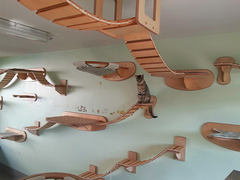

# Cat's Playground

A little sandbox to play with new technologies and general problems.

## Scripts

* `yarn start` runs the app for development in [localhost:3000/home](http://localhost:3000/home).
* `yarn test` launches the test runner in the interactive watch mode.
* `yarn build` builds the app for production to the `build` folder.
* `yarn lint` quietly tries to fix your code.
* `yarn sort` sorts package.json in alphabetical order.

## Tech

* This project was bootstrapped with [Create React App](https://github.com/facebook/create-react-app).
* Using [generate-react-cli](https://www.npmjs.com/package/generate-react-cli) to generate react components.
* Configured SASS pre-compile in webpack.
* Added prettier for beautiness.
* Set with an MIT Licence.
